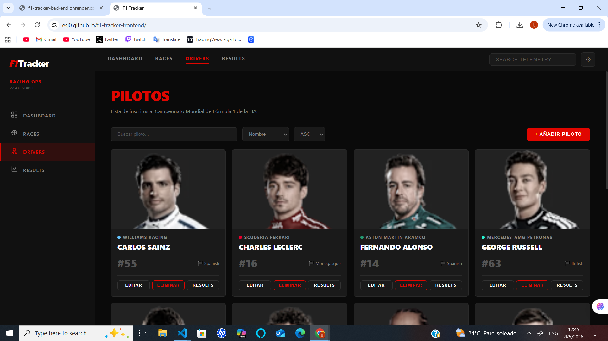

# 🏁 F1 Tracker — Frontend

Cliente en JavaScript vanilla para la API de F1 Tracker. Sin frameworks, sin librerías — solo `fetch()` y el DOM.

🔗 **Repositorio del backend**: https://github.com/ESJ0/f1-tracker-backend.git  
🌐 **Aplicación en producción**: https://esj0.github.io/f1-tracker-frontend/


---

## Tecnologías utilizadas

- HTML5
- CSS3 (variables, grid, flexbox)
- JavaScript ES6+ vanilla
- `fetch()` para todas las llamadas a la API
- Deploy: GitHub Pages

---

## Screenshot



## Correr localmente

No requiere ningún paso de build.

### Opción 1 — Live Server en VS Code

Instala la extensión **Live Server**, clic derecho en `index.html` → **Open with Live Server**.

### Opción 2 — Python

```bash
cd f1-tracker-frontend
python3 -m http.server 3000
```

### Opción 3 — Node

```bash
npx serve .
```

Abre `http://localhost:3000`.

> ⚠️ El backend debe estar corriendo en `http://localhost:8080` para que funcione localmente.  
> En producción, `API_BASE` en `js/api.js` apunta al backend deployado en Render.

---

## Estructura del proyecto

```
f1-tracker-frontend/
├── index.html              # Shell principal, sidebar, modal, toast
├── css/
│   └── styles.css          # Dark mode, tema rojo y blanco F1
├── js/
│   ├── api.js              # Todas las llamadas fetch() a la API REST
│   ├── utils.js            # Helpers: debounce, formatDate, toast, modal, paginación
│   ├── ui.js               # Render del DOM por sección
│   └── app.js              # Entry point, router del cliente, event listeners
├── assets/
│   ├── drivers/            # Imágenes de pilotos descargadas localmente
│   ├── circuits/           # Imágenes de circuitos descargadas localmente
│   
└── README.md
```

---

## Funcionalidades

- **Dashboard** — tarjetas de estadísticas, carrera destacada, panel de resultados recientes, barra de progreso de temporada
- **Pilotos** — grid de tarjetas con foto, color de equipo y número; búsqueda, ordenamiento y paginación; crear, editar y eliminar desde modal; ver historial de resultados por piloto
- **Carreras** — calendario en grid con badge de ronda; búsqueda, ordenamiento y paginación; crear, editar y eliminar; ver y añadir resultados por carrera
- **Resultados** — tabla de clasificación filtrada por carrera; posición, constructor, puntos e indicador de vuelta rápida

---

## CORS

Es una política de seguridad del navegador que impide que las páginas web hagan peticiones a un origen distinto al que las sirvió. El backend está configurado para permitir todos los orígenes durante desarrollo y producción.

---

## Challenges implementados

- ✅ Códigos HTTP correctos consumidos y manejados en la interfaz
- ✅ Búsqueda por nombre (`?q=`) con debounce
- ✅ Ordenamiento (`?sort=` / `?order=`) mediante dropdowns
- ✅ Paginación con controles de página
- ✅ Errores de validación del servidor mostrados como notificaciones toast

---

## Reflexión

Para el frontend utilicé JavaScript con fetch() obligando a mantener una separación clara entre la obtención de datos, el renderizado y la lógica de la aplicación , algo que normalmente maneja un framework. Para un proyecto más grande usaríamos un framework liviano como react, pero para un tracker CRUD de este tamaño, vanilla JS mantuvo todo simple y fácil de depurar. Lo volvería a usar en proyectos pequeños sin dudarlo.